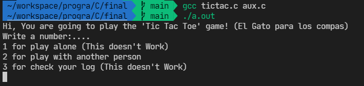
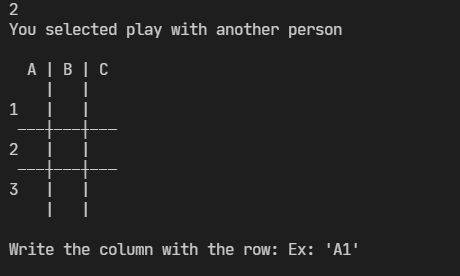

# Tic Tac Toe

## Demo

[Video on YT](https://www.youtube.com/watch?v=fmE-H8HFVrQ)

## The Final Project of Structured Programming

This program consist in the famous tic tac toe game (El Gato para los compas)

### Modes

If you wish watch the modes of this game, please click the link below:

[Modes.md](modes.md)

### Considerations

If you want to see the Considerations, messages when an error happen, please click below:

[Considerations.md](considerations.md)

### Rules

This game is literally a Matrix (3x3), and we could have an 'x' or 'o'

We can play with 2 people or with one person and the computer

When you got 3 'x' or 3 'o' in a row, you win

### Playing

#### Introduction

We have a little menu with different options:

#### Grid

We have a little grid of the game that is a Matrix like this:

You will enter something like 'A1' and the program will recognize the position in the matrix

(Column with letters, Row with numbers)

## Compiling

You MUST compile like this:

`$ gcc tictac.h aux.c tictac.c`

### By hectormtz (HectorMtz22)

#### Credits (Help, and Greetings)

[The Coding Train](https://www.youtube.com/watch?v=GTWrWM1UsnA)

# Autoeval

1: complexity 3 (I think this game doesn't have a lot of complexity but I did it single (With random positions) and multiplayer, and added a history)
2: functionality 3 (I made error messages to prevent `Segmentation fault`)
3: code 3 (I clean the functions and made subroutines)
4: storage 3 (I separate libraries that I'm using in tictac.c and aux.c)
5: documentation 3 (I made a report with md in different archives)

I think for this project I have 15 points