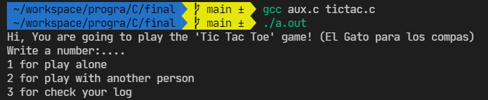

# Tic Tac Toe

## The Final Project of Structured Programming

This program consist in the famous tic tac toe (El Gato para los compas)

## Rules

This game is literally a Matrix (3x3), and we could have an 'x' or 'o'

We can play with 2 people or with one person and the computer

When you got 3 'x' or 3 'o' in a row, you win

## Playing

### Introduction

We have a little menu with different options:

### Grid

We have a little grid of the game that is a Matrix like this:

## Compiling

You MUST compile like this:

`$ gcc tictac.h aux.c tictac.c`

### By hectormtz (HectorMtz22)
