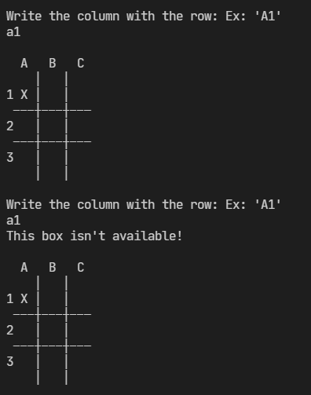
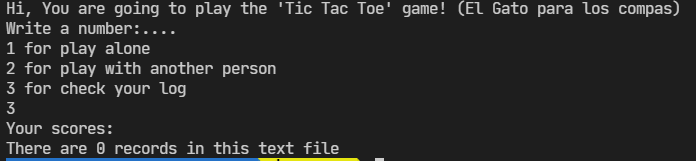
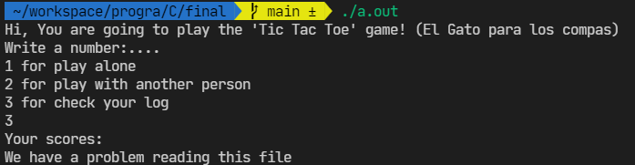

# Considerations

## Cell not available

When you enter a cell that isn't available in the matrix, it will prompt a message:

## Without records

If you don't have any score yet and go to the point number 3, you will see something like this:

NOTE: When you play a game, automatically create a file called `results.txt`

## What about if you delete `results.txt`?

If you delete this file and you play a game, it will create the file

If you go to the point 3, it will print a message like this:

