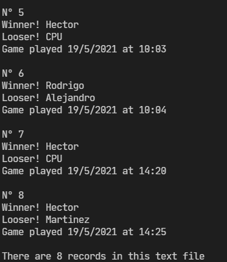

### Modes:

#### 1) SinglePlayer

This is when you want to play versus the CPU

When you play, automatically the CPU plays the other player

When someone wins, you will enter your name:

#### 2) MultiPlayer 

This is when you want to play versus someone else locally

When someone introduce the cell, is the turn of the second player

When someone wins, the program will put the playwe that won the game

And it will ask the names of the winner and the looser

#### 3) Get Scores 

When you select this option automatically prints the scores

It read the timestamp and transform to date with time

